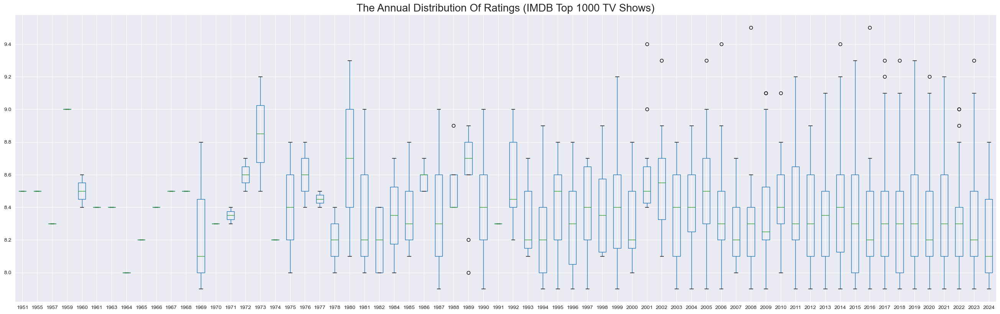
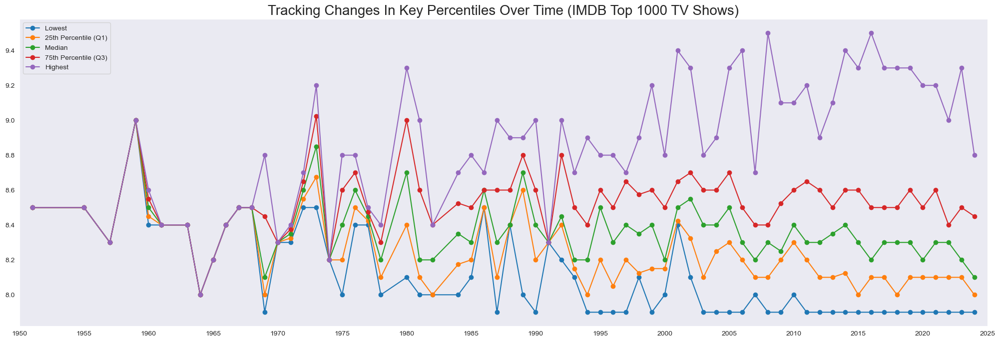
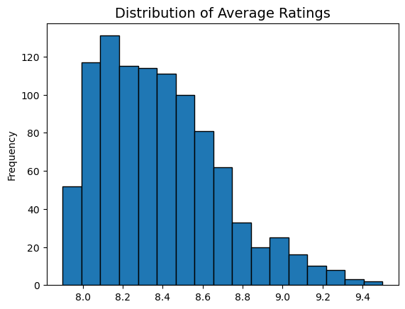
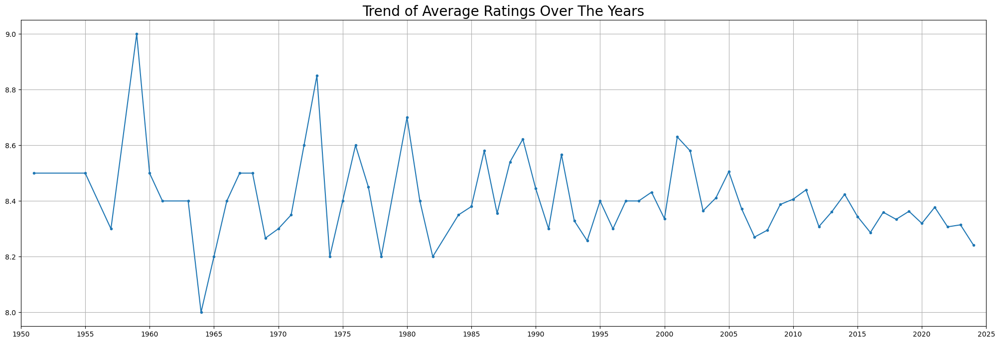
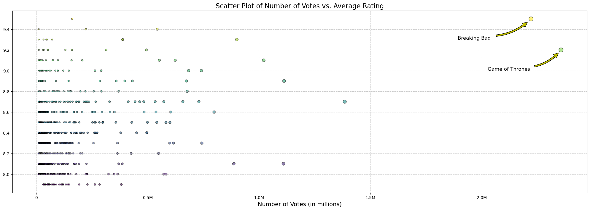
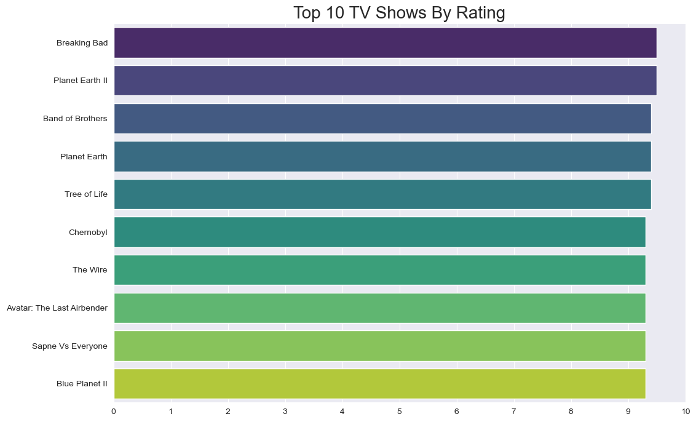
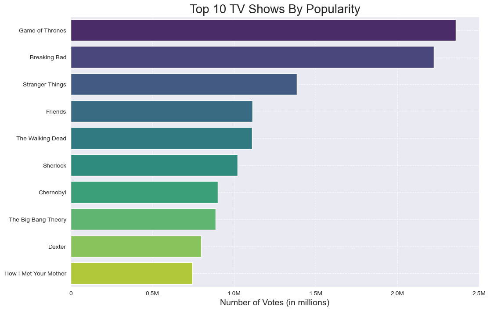
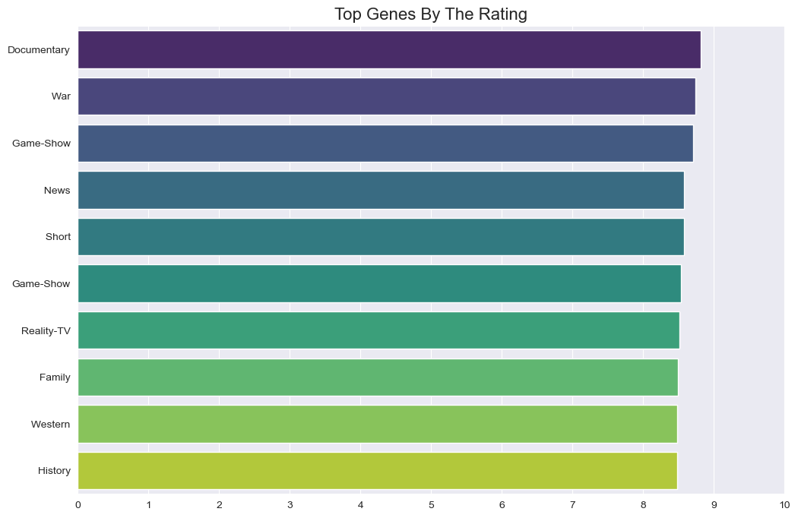
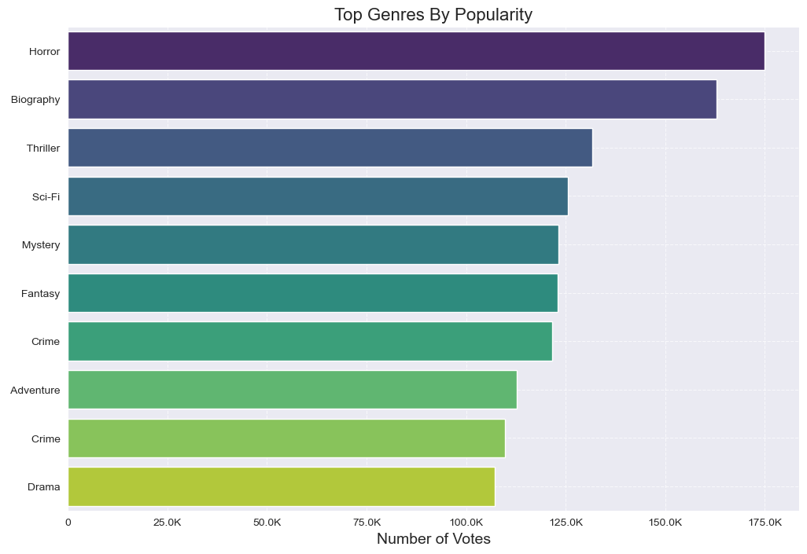
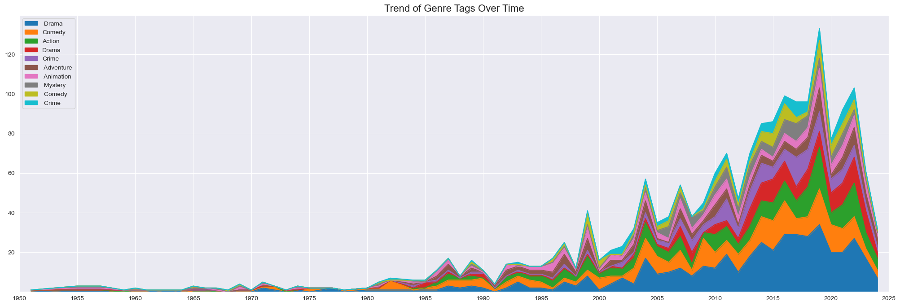

# Overview

Welcome to my analysis of the top 1000 shows based on IMDB ratings. This project was driven by my curiosity and a desire to apply the skills I've learned so far.

The data for this analysis is sourced from [kaggle.com (IMDb Top 1000 TV Series)](https://www.kaggle.com/datasets/octopusteam/imdb-top-1000-tv-series?resource=download), which provides detailed information on titles, genres, average ratings, popularity, and release years. Using a series of Python scripts, I explore key questions such as how show quality has changed over the years, shifts in genre popularity, and the most dominant shows.

# The Questions

Below are the questions I want to answer in my project:

1. What are the trends in TV show quality over time?
2. How are the ratings of top TV shows distributed?
3. How have average ratings for TV shows changed over the years?
4. What is the relationship between the number of votes and average ratings for TV shows?
5. What are the top 10 TV shows based on ratings and popularity?
6. What are the top 10 genres based on ratings and popularity?
7. How have the genre tags on TV shows evolved over time?

# Tools I Used

For my deep dive into the top 1000 tv series on IMDB, I harnessed the power of several key tools:

- **Python:** The backbone of my analysis, allowing me to analyze the data and find critical insights.I also used the following Python libraries:
    - **Pandas Library:** This was used to analyze the data. 
    - **Matplotlib Library:** I visualized the data.
    - **Seaborn Library:** Helped me create more advanced visuals. 
- **Jupyter Notebooks:** The tool I used to run my Python scripts which let me easily include my notes and analysis.
- **PyCharm:** My go-to for executing my Python scripts.
- **GitHub:** Sharing my Python code and analysis, ensuring project tracking.

## Import & Clean Up Data

I start by importing necessary libraries and loading the dataset.

```
# Importing Libraries
import pandas as pd
import seaborn as sns
import matplotlib.pyplot as plt

#Loading Data
dataset = pd.read_csv(r'data/IMDB_Top_1000_TV_shows.csv')
```

# The Analysis
Each Jupyter notebook for this project aimed at investigating specific aspects of the data. Here’s how I approached each question:

## 1. What are the trends in TV show quality over time?

### Visualize Data

```python
# Plotting the trends
df.boxplot(column='averageRating', by='releaseYear', figsize=(32, 10))

# Show the plot
plt.show()
```

### Results


### Insights:

- **Higher Ratings in Earlier Years:** In the 1950s and 1960s, ratings generally trend higher, with medians closer to or above 8.5. This suggests that shows from these earlier decades received higher average ratings compared to later years.

- **Increased Rating Variability:** Starting from the 1970s, there’s a notable increase in variability, with larger interquartile ranges and more outliers, indicating a mix of high and low ratings. This suggests that shows from these periods vary widely in audience reception.

- **Steady Ratings in Recent Years:** From around 2010 onwards, the ratings show less variation, with medians consistently between 7.5 and 8. This could imply that recent TV shows maintain a more consistent rating level but rarely reach extreme highs or lows.

### Visualize Data

```python
# Group by 'releaseYear' and calculate the percentiles
rating_trends = df.groupby('releaseYear')['averageRating'].agg(
    lowest='min',
    Q1='quantile',
    median='median',
    Q3='quantile',
    highest='max'
).reset_index()

# Calculate 25% (Q1) and 75% (Q3)
rating_trends['Q1'] = df.groupby('releaseYear')['averageRating'].quantile(0.25).values
rating_trends['Q3'] = df.groupby('releaseYear')['averageRating'].quantile(0.75).values

# Plotting the trends
plt.figure(figsize=(25, 8))
plt.plot(rating_trends['releaseYear'], rating_trends['lowest'], label='Lowest', marker='o')
plt.plot(rating_trends['releaseYear'], rating_trends['Q1'], label='25th Percentile (Q1)', marker='o')
plt.plot(rating_trends['releaseYear'], rating_trends['median'], label='Median', marker='o')
plt.plot(rating_trends['releaseYear'], rating_trends['Q3'], label='75th Percentile (Q3)', marker='o')
plt.plot(rating_trends['releaseYear'], rating_trends['highest'], label='Highest', marker='o')

# Adjust the x-axis ticks to show every 5 years
plt.xticks(ticks=range(min(rating_trends['releaseYear'] - 1), max(rating_trends['releaseYear']) + 2, 5))

# Show the plot
plt.show()
```

### Results


### Insights:

- **Stabilization in Recent Years:** The median, along with the 25th and 75th percentiles, shows less fluctuation from around 2005 onwards, indicating that average ratings for TV shows have become more consistent in recent years. This could suggest a standardization in TV show quality or rating criteria.

- **Peaks in Highest Ratings:** The line for the highest ratings (purple) has several spikes, especially noticeable in the 1950s, late 1970s, and early 2010s. These peaks likely correspond to exceptionally well-received shows, hinting at notable classics or popular modern hits. Annotating these peaks could add value by pinpointing which shows made such an impact.

- **Wider Spread in the 1990s:** The distance between the highest and lowest ratings is more pronounced in the 1990s, indicating a broader range in the quality or reception of shows from that period. This may reflect a more experimental era in television, with some shows achieving high acclaim and others receiving lower scores.

<span style="color: #66CDAA;">*Even through these two plots might seem similar, one shows the annual distribution of ratings (Box Plot) and the other tracks changes in key percentiles over time (Line Plot).*</span>


## 2. How are the ratings of top TV shows distributed?

### Visualize Data

```python
# Distribution of Average Ratings
df['averageRating'].plot(kind='hist', bins=17, edgecolor='black')

# Show the plot
plt.show()
```
### Results


### Insights:

- **High Overall Ratings:** Given that this dataset represents the top 1000 shows on IMDb, the right-skewed distribution (with most ratings between 8.0 and 8.6) suggests that highly rated shows dominate, reflecting consistent quality among the best-rated series.

- **Peak Popularity Around 8.2:** The most common rating among the top shows is around 8.2, indicating that a large portion of these highly regarded series falls in this range. This rating can be seen as the "benchmark" for quality in the top 1000 shows.

- **Exclusive Few Above 9.0:** Only a select few shows achieve ratings above 9.0, underscoring their exceptional status even among the best. These outliers likely represent some of the most iconic and universally acclaimed shows on IMDb.

## 3. How have average ratings for TV shows changed over the years?

### Visualize Data

```python
plt.figure(figsize=(25, 8))
plt.xlim(1950, 2025)
df.groupby('releaseYear')['averageRating'].mean().plot(kind='line', marker='.')

# Adjust the x-axis ticks to show every 5 years
plt.xticks(ticks=range(min(rating_trends['releaseYear'] - 1), max(rating_trends['releaseYear']) + 2, 5))

# Show the plot
plt.show()
```
### Results


### Insights:

- **Fluctuating Ratings in Early Years:** The average ratings of the top 1000 TV shows display significant volatility from the 1950s through the 1980s, marked by several peaks above 8.5 and dips near 8.0. This variability could be attributed to the smaller number of shows produced during this period, which likely intensified the impact of individual ratings on the overall trend.

- **Stabilization in Recent Years:** After 2000, the average ratings show a more consistent pattern, generally staying between 8.2 and 8.4, with fewer drastic fluctuations compared to earlier years.

- **Gradual Decline Post-2015:** A subtle downward trend is observed in average ratings starting around 2015, suggesting a potential shift in viewer preferences or rating standards in recent years.

## 4. What is the relationship between the number of votes and average ratings for TV shows?

### Visualize Data

```python
from matplotlib.ticker import FuncFormatter

# Create a function to format the x-axis labels
def millions_formatter(x, _):
    return f'{x / 1_000_000:.1f}M' if x >= 500_000 else str(int(x))  # Format as '1.5M', '2.0M', etc.

# Create a scatter plot with enhancements
plt.figure(figsize=(25, 8))

# Plot marker size based on numVotes
scatter = plt.scatter(df['numVotes'], df['averageRating'], 
                      alpha=0.6, c=df['averageRating'], cmap='viridis', 
                      s=(df['numVotes'] / df['numVotes'].max()) * 100 + 10, edgecolor='k')

# Define criteria for outliers; you can adjust these as needed
outlier_conditions = (
    (df['averageRating'] >= 9.0) & (df['numVotes'] >= 2000000)  # Example condition for high-rated shows
)

# Select the outliers based on defined conditions
outliers = df[outlier_conditions]

# Annotate the outliers
for index, row in outliers.iterrows():
    plt.annotate(row['title'], 
                 xy=(row['numVotes'], row['averageRating']), 
                 xytext=(row['numVotes'] - 330000, row['averageRating'] - 0.2),  # Adjusted for reverse arrow direction
                 arrowprops=dict(facecolor='y', shrink=0.11, connectionstyle='arc3,rad=0.2'),  # Use angle3 with specified angles
                 fontsize=12)

# Set limiter
plt.xlim(0, 2_500_000)
    
# Apply the millions formatter to the x-axis
plt.gca().xaxis.set_major_formatter(FuncFormatter(millions_formatter))

# Show the plot
plt.show()
```
### Results


### Insights:

- **Highly Rated Shows with High Votes:** Popular shows like "Breaking Bad" and "Game of Thrones" stand out with both high average ratings (above 9) and a high number of votes (over 2 million), showing a strong positive correlation between popularity and ratings.

- **Density Around Mid-Level Votes and Ratings:** The majority of shows cluster around average ratings of 8.0 to 8.8 with vote counts ranging from a few hundred thousand to under one million, indicating a typical range for popular yet less unanimously acclaimed shows.

- **Lower Ratings with Fewer Votes:** There are fewer shows with lower ratings (near 8.0) and low vote counts, suggesting that TV shows in the top 1000 are generally well-received and tend to have a substantial fanbase.

## 5. What are the top 10 TV shows based on ratings and popularity?

### Visualize Data

```python
# Define top 10 shows by rating
top_rat = df.nlargest(10, 'averageRating')

# Create a horizontal bar plot with seaborn
plt.figure(figsize=(12, 8))
sns.barplot(data=top_rat, x='averageRating', y='title', hue='title',  palette='viridis')

# Show the plot
plt.show()
```
### Results


### Insights:

- **Top-Rated Shows on IMDb:** "Breaking Bad" leads as the highest-rated show among the top 1000 IMDb-rated TV shows, showcasing its widespread acclaim and popularity.

- **Nature and Documentary Series Stand Out:** Documentaries such as "Planet Earth II," "Planet Earth," and "Blue Planet II" rank highly, indicating the strong appeal of high-quality, nature-focused content to audiences.

- **Consistent Excellence Across Genres:** This list includes a diverse range of genres, from animated series like "Avatar: The Last Airbender" to intense dramas like "The Wire" and "Chernobyl," suggesting that top-rated shows are not confined to a single genre but span various themes and formats.

### Visualize Data

```python
# Define top 10 shows by popularity
top_num = df.nlargest(10, 'numVotes')

# Create a horizontal bar plot with seaborn
plt.figure(figsize=(12, 8))
sns.barplot(data=top_num, x='numVotes', y='title', hue='title',  palette='viridis')

# Set limiter
plt.xlim(0, 2_500_000)

# Apply the millions formatter to the x-axis
plt.gca().xaxis.set_major_formatter(FuncFormatter(millions_formatter))

# Show the plot
plt.show()
```

### Results


### Insights:

- Game of Thrones and Breaking Bad dominate in popularity, with both shows receiving significantly more votes than other series, showcasing their widespread appeal and strong fan bases.

- Stranger Things and Friends follow as the next most popular shows, indicating a blend of both contemporary and nostalgic preferences among viewers.

- How I Met Your Mother ranks the lowest in popularity among the top ten, highlighting a smaller, though still substantial, following compared to the leading shows.

## 6. What are the top 10 genres based on ratings and popularity?

### Exploding the data

```python
# Assuming genres are separated by commas
df['genres'] = df['genres'].str.split(',')

# Explode the genres into separate rows
df_exploded = df.explode('genres')

# Strip any whitespace from the genre names
df_exploded['genres'] = df_exploded['genres'].str.strip()
```

### Visualize Data

```python
# Calculate the mean average rating for each genre and select the top 10
genre_ratings = df.explode('genres').groupby('genres')['averageRating'].mean().sort_values(ascending=False).head(10).reset_index()

# Create a horizontal bar plot with seaborn
plt.figure(figsize=(12, 8))
sns.barplot(data=genre_ratings, x='averageRating', y='genres', hue='genres', palette='viridis')

# Show the plot
plt.show()
```
### Results


### Insights:

- **Documentary and War Genres Lead in Ratings:** The "Documentary" and "War" genres have the highest ratings, suggesting that audiences rate these genres favorably, possibly due to their informative or impactful nature.

- **Popularity Across Informational Content:** Genres like "News," "Documentary," and "History" are highly rated, indicating a strong viewer interest in content that provides knowledge, context, or real-world insights.

- **Family and Western Genres Also Well-Rated:** Though traditionally niche, "Family" and "Western" genres have high ratings, suggesting a notable appreciation for these types of content among viewers.

### Visualize Data

```python
# Calculate the mean average votes for each genre and select the top 10
genre_votes = df.explode('genres').groupby('genres')['numVotes'].mean().sort_values(ascending=False).head(10).reset_index()

# Create a horizontal bar plot with seaborn
plt.figure(figsize=(12, 8))
sns.barplot(data=genre_votes, x='numVotes', y='genres', hue='genres', palette='viridis')

# Create a function to format the x-axis labels
def millions_formatter(x, _):
    return f'{x / 1_000:.1f}K' if x >= 25_000 else str(int(x))  # Format as '25K', '50K', etc.

# Apply the millions formatter to the x-axis
plt.gca().xaxis.set_major_formatter(FuncFormatter(millions_formatter))

# Show the plot
plt.show()
```

### Results


### Insights:

- **Horror Genre Dominates:** Horror is the most popular genre by a significant margin, receiving the highest number of votes compared to other genres.

- **Biography and Thriller are Close Contenders:** Biography and Thriller follow Horror, showing substantial popularity and similar vote counts, making them strong competitors in audience preference.

- **Drama has Lower Popularity:** Drama ranks the lowest in this chart, with fewer votes compared to the other genres, indicating relatively lower interest in this category among audiences.

## 7. How have the genre tags on TV shows evolved over time?

### Preparing the data

```python
# Clean up the genre names by stripping spaces and converting to capitalized
df['genres'] = df['genres'].apply(lambda x: [genre.strip().title() for genre in x])

# Remove duplicates within the 'genres' column
df['genres'] = df['genres'].apply(lambda x: list(set(x)))  # Remove duplicates in the list of genres

# Explode the 'genres' column to have each genre as a separate row, then group by 'releaseYear' and 'genres'
genre_counts = df.explode('genres').groupby(['releaseYear', 'genres']).size().unstack(fill_value=0)

# Calculate the total count for each genre
total_genre_counts = genre_counts.sum(axis=0)  # Sum counts for each genre across all years

# Identify the top 10 genres
top_10_genres = total_genre_counts.nlargest(10).index  # Get the names of the top 10 genres

# Filter the genre_counts DataFrame to include only the top 10 genres
top_10_genre_counts = genre_counts[top_10_genres]
```

### Visualize Data

```python
# Plotting the data
top_10_genre_counts.plot(kind='area', stacked=True, figsize=(25, 8))

# Adjust the x-axis ticks to show every 5 years
plt.xticks(ticks=range(min(rating_trends['releaseYear'] - 1), max(rating_trends['releaseYear']) + 2, 5))

# Move the legend to the top left corner
plt.legend(loc="upper left")

# Limit axis
plt.xlim(1950, 2025)
plt.ylim(bottom=0.1)  # Adjust bottom limit to 0.1 or another value greater than 0

# Show the plot
plt.show()
```

### Results


### Insights:
